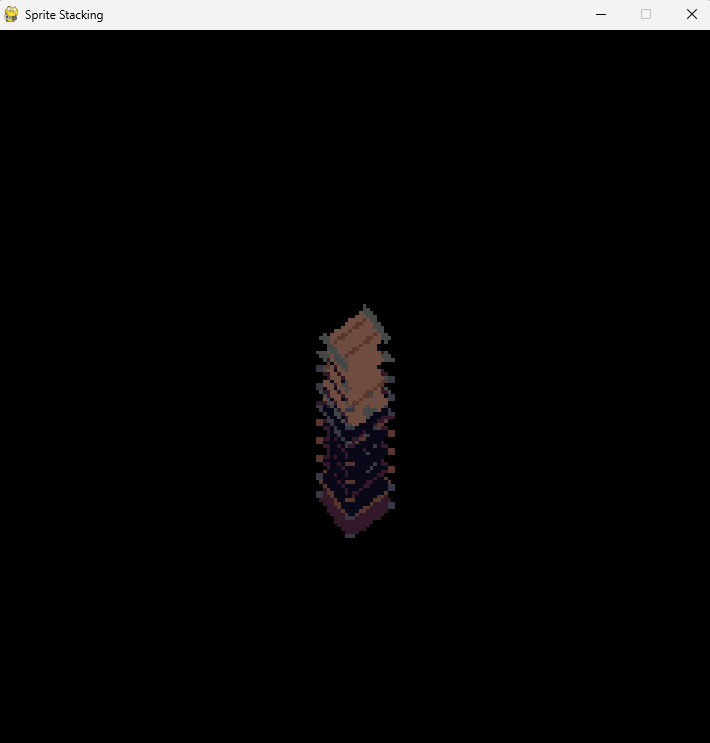

# 🎮 3D... but it's all smoke and mirrors

**Sprite stacking** is a clever technique used in 2D graphics to simulate 3D objects by layering multiple 2D sprites with slight vertical offsets. This creates the illusion of depth and volume—like 3D, but without the math-heavy overhead.

This project presents a simple and clear implementation of sprite stacking using **Python** and **Pygame**.

---

## 🧠 What is Sprite Stacking?

Sprite stacking works by placing several slices (2D images) on top of each other, each representing a "layer" of a 3D object. When these layers are rendered with a small vertical offset between them, the result appears as a single 3D-like object in a 2D environment.

---

## 🛠️ Technologies Used

- **Python 3**
- **Pygame** – for rendering and window management

---

## 🚀 Getting Started

- Clone the repository
- Install the PyGame dependencie with **pip install pygame**
- Run teh project **python sprite_stack.py**
- You can change the rotation of the sprite with **left** and **right** arrow
- You can change the offset of the stack with **up** and **down** arrow 

## Preview

